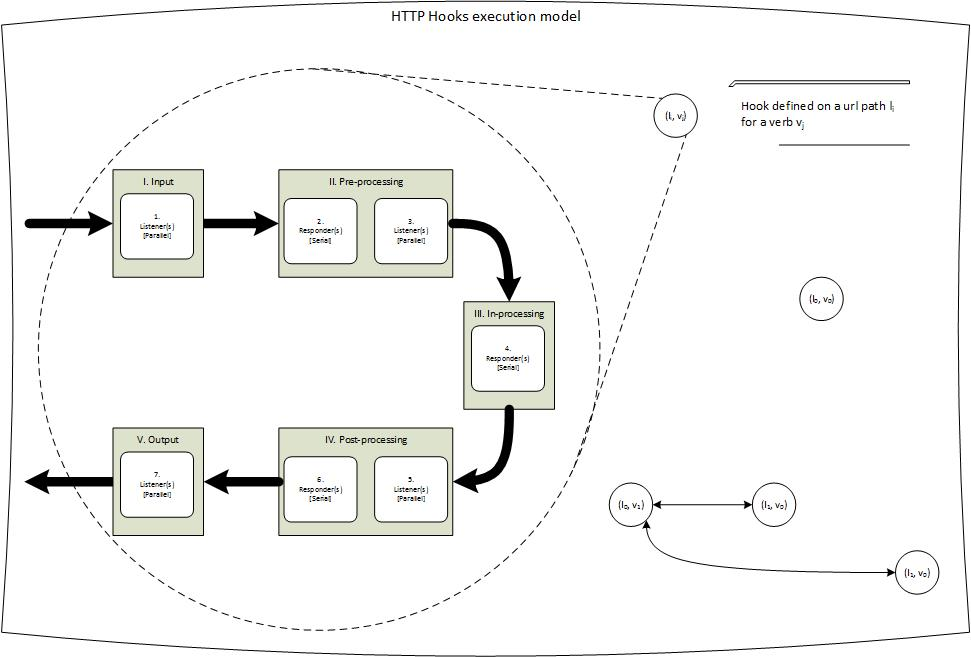

# General design
**Author:** Elmar Langholz

Since there has not been any well defined and standardised model for HTTP hooks, in this document we present both the concepts and detailed implementation of the proposed model.

## Architecture

HTTP hooks relies on a pub-sub (publisher-subscriber) architecture which gives us the advantage of being able to link and generate dependency chains between compute or i/o units (in the form of a graph) such that their relationship is established through a schema and url path (instead of through direct linking like jsonp does). This gives us the facility, between other things, to iterate quickly on independent logical units and update separately from other logical units by maintaining a well defined interface/contract between these and focus on the internal logic. This type of neat abstract decoupling is respresented by defining a hook on a resource location or url path defined at code level.

## Hooks

A hook, is a subscription to a resource location (a.k.a url path) which has the intent of servicing a request or signaling the existence of a request of a given action or verb whenever something or someone publishes to it. There are different types of hooks that are executed at different stages (based on their subscription) and a corresponding capability is attributed to each. At any stage, one can have a single or multiple subscriptions to a resource location.

### Types

There are two different types of supported hooks:

<table>
  <tr>
    <th>Hook Type</th>
    <th>Description</th>
  </tr>
  <tr>
    <th>Responders</th>
    <td>Refers to the hook type which actively processes a request and produces a response. Its primary intent is for processing and contibuting to the system in the form of a response.</td>
  </tr>
  <tr>
    <th>Listeners</th>
    <td>Refers to the hook type which passively processes a request but who's response is not taken into account. Its primary intent is to be used for signaling and identifying events.</td>
  </tr>
</table>

### Stages

Each hook type can be defined to execute in one of the following stages:

<table>
  <tr>
    <th>Hook Stage</th>
    <th>Description</th>
  </tr>
  <tr>
    <th>Input</th>
    <td>
        Refers to the execution of hooks which do not alter the request or execution chain in any shape or form. These are listener hooks that serve the purpose of signaling or forwarding the actual incomming request.
  </tr>
  <tr>
    <th>Pre-Processing</th>
    <td>
        Refers to execution a hook before the in-processing and post-processing stages (in the listed order). If the hook is a responder then it is expected that it validates and/or normalizes the request content input. If the hook is a listener then it is expected that it signals or forward the response of the processed (validation and/or normalization) request content that just occured.
    </td>
  </tr>
  <tr>
    <th>In-Processing</th>
    <td>
        Refers to execution a hook after the pre-processing stage, but before the post-processing stage. If the hook is a responder then it is expected that it processes the request. There should be no listener hooks at this stage.
    </td>
  </tr>
  <tr>
    <th>Post-Processing</th>
    <td>
        Refers to execution a hook after the pre-processing and in-processing stages (in the listed order). If the hook is a responder then it is expected that it enhances and/or normalizes the request content output. If the hook is a listener then it is expected that it signals or forward the response of the processed (enhancement and/or normalization) request content that just occured.
    </td>
  </tr>
  <tr>
    <th>Output</th>
    <td>
        Refers to the execution of hooks which do not alter the response or execution chain in any shape or form. These are listener hooks that serve the purpose of signaling or forwarding the actual outgoing request.
    </td>
  </tr>
</table>

### Execution order

Having defined the differnt types of hooks and the available execution stages, when joining these together these are executed in the following order:

<table>
  <tr>
    <th>Execution Order</th>
    <th>Execution Stage</th>
    <th>Hook Type</th>
    <th>Description</th>
  </tr>
  <tr>
    <th>1</th>
    <td>Input</td>
    <td>Request-Listener</td>
    <td>
        If one or more (whether in the same service or not) request-listener(s) (e.g. non-responder(s)) are defined, these are executed in an undefined order parallel from each other and it does not contribute a response, independent of status code or content. Processing of other hooks is continued even if execution of these is not complete.
    </td>
  </tr>
  <tr>
    <th>2</th>
    <td>Pre-Processing</td>
    <td>Pre-Responder</td>
    <td>
        If one or more (whether in the same service or not) pre-processing responder(s) are defined, these are executed in an undefined order but in serial (one after another) instead of parallel from each other. Only when all of the hooks have been executed will processing continue.
        
If the status code returned from any of the responding hooks is Continue (100), the original content for the request is replaced by the response content from it.

        
If the status code returned from any of the responding hooks is successful (2xx), the original content for the request is maintained and nothing happens.

        
If the status code returned from any of the responding hooks is neither successful (2xx) nor Continue (100) this is treated as an error and the invocation of subsequent hooks is terminated with the corresponding status code and payload.

    </td>
  </tr>
  <tr>
    <th>3</th>
    <td>Pre-Processing</td>
    <td>Pre-Listener</td>
    <td>
        If one or more (whether in the same service or not) pre-processing non-responder(s) are defined, these are executed in an undefined order parallel from each other and it does not contribute to the final response, independent of status code or content. Processing of other hooks is continued even if execution of these is not complete.
    </td>
  </tr>
  <tr>
    <th>4</th>
    <td>In-Processing</td>
    <td>Responder</td>
    <td>
        If one or more in-processing responder(s) are defined these are executed in undefined order in parallel from each other and only when all of these are executed and completed will processing of continue.
    </td>
  </tr>
  <tr>
    <th>5</th>
    <td>Post-Listener</td>
    <td>Post-Processing</td>
    <td>
        If one or more (whether in the same service or not) post-processing non-responder(s) are defined, these are executed in an undefined order parallel from each other and it does not contribute to the final response, independent of status code or content. Processing of other hooks is continued even if execution of these not complete.
    </td>
  </tr>
  <tr>
    <th>6</th>
    <td>Post-Processing</td>
    <td>Post-Responder</td>
    <td>
        If one or more (whether in the same service or not) post-processing responder(s) are defined, these are executed in an undefined order but in serial (one after another) instead of parallel from each other. Only when all of the hooks have been executed is the final response relayed.
        
If the status code returned from any of the responding hooks is Continue (100), the content for the final response is replaced by the response content from this.

        
If the status code returned from any of the responding hooks is successful (2xx), the original content for the final response is maintained and nothing happens.

        
If the status code returned from any of the responding hooks is neither successful (2xx) nor Continue (100) this is treated as an error, the original content for the final response is replaced with the response from this and the invocation of subsequent hooks is terminated.

    </td>
  </tr>
  <tr>
    <th>7</th>
    <td>Output</td>
    <td>Response-Listener</td>
    <td>
        If one or more (whether in the same service or not) response-listener(s) (e.g. non-responder(s)) are defined, these are executed in an undefined order parallel from each other and it does not contribute a response, independent of status code or content. Processing of other hooks is continued even if execution of these is not complete.
    </td>
  </tr>
</table>
